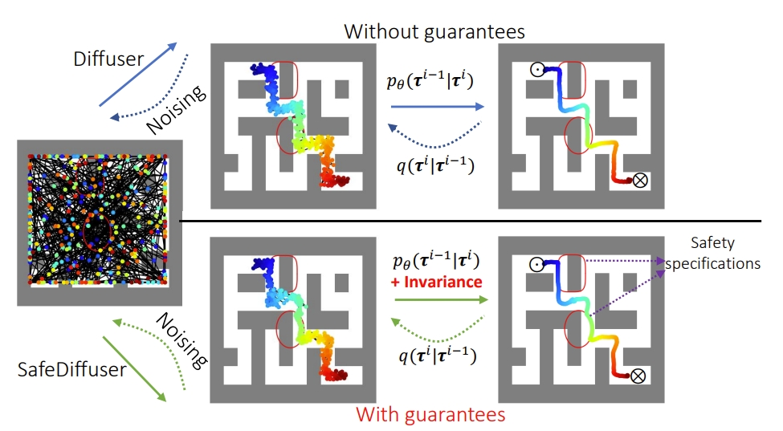

# SafeDiffuser
Implementation of our ICLR 2025 paper - SafeDiffuser: Safe Planning for Diffusion Probabilistic Models


 


# Installation
```
conda env create -f environment.yml
conda activate safediffuser
pip install -e .
pip install qpth cvxpy cvxopt
```

# Switch between different experiments
```
git switch maze2d/locomotion/kuka
```

# Important notes for SafeDiffusers

1. run the following code first before running any code to address potential bugs (mujoco200 is needed)
```
export LD_LIBRARY_PATH=$LD_LIBRARY_PATH:/usr/lib/nvidia-515
export LD_LIBRARY_PATH=$LD_LIBRARY_PATH:/home/wei/.mujoco/mujoco200/bin
```
2. Choose diffusers/CG/Truncate/different safediffusers 

(I) maze2d case:

(1) Choose any one option betwee lines 1040 and 1095 of the file diffuser/models/diffusion.py

(2) Choose any one option betwee lines 300 and 358 of the file diffuser/utils/rendering.py   (for visualization purpose)

(3) Customize the diffusion output in the file diffuser/guides/policies.py  (__call__ function)

(4) Customize the diffusion saving/print in the files scripts/plan_maze2d.py (especially after line 55) and config/maze2d.py

(II) locomotion (walker2d and hopper) case:

Choose any one option betwee lines 177 and 207 of the file diffuser/models/diffusion.py

(III) Manipulation (kuka) case:

Choose any one option betwee lines 405 and 439 of the file denoising_diffusion_pytorch/denoising_diffusion_pytorch.py


# Use pre-trained models
## 1. Downloading weights
Download pretrained diffusion models and value functions (from diffuser) with:
```
./scripts/download_pretrained.sh
```

## 2. Planning using pre-trained models
To plan with guided sampling, run:

Maze2d:

```
python scripts/plan_maze2d.py --config config.maze2d --dataset maze2d-large-v1 --logbase logs/pretrained
```

Locomotion:

```
python scripts/plan_guided.py --dataset walker2d-medium-expert-v2 --logbase logs/pretrained
```

Manipulation (unconditional):

```
python scripts/unconditional_kuka_planning_eval.py
```

The --logbase points the experiment loader to the folder containing the pretrained/self-trained models.

# Training from scratch
## 1. Train a diffusion model with:

Maze2d:

```
python scripts/train.py --config config.maze2d --dataset maze2d-large-v1
```

Locomotion:

```
python scripts/train.py --dataset walker2d-medium-expert-v2
```

Manipulation:

```
python scripts/kuka.py
```

The default hyperparameters are listed in maze2d/locomotion:diffusion. You can override any of them with flags, eg, --n_diffusion_steps 100.

## 2. Train a value function with:
```
python scripts/train_values.py --dataset walker2d-medium-expert-v2
```
See locomotion:values for the corresponding default hyperparameters.

## 3. Plan using your newly-trained models with the same command as in the pretrained planning section, simply replacing the logbase to point to your new models:

Maze2d:

```
python scripts/plan_maze2d.py --config config.maze2d --dataset maze2d-large-v1 --logbase logs
```

Locomotion:

```
python scripts/plan_guided.py --dataset walker2d-medium-expert-v2 --logbase logs
```

Manipulation(unconditional): 

```
python scripts/unconditional_kuka_planning_eval.py
```

# Reference
If you find this helpful, please cite our work:
```
@inproceedings{xiao2025safe,
  title = {SafeDiffuser: Safe Planning with Diffusion Probabilistic Models},
  author = {Wei Xiao and Tsun-Hsuan Wang and Chuang Gan and Ramin Hasani and Mathias Lechner and Daniela Rus},
  booktitle = {International Conference on Learning Representations},
  year = {2025}
}
```

# Acknowledgements
The diffusion model implementation and organization are based on Michael Janner's diffuser repo: https://github.com/jannerm/diffuser
